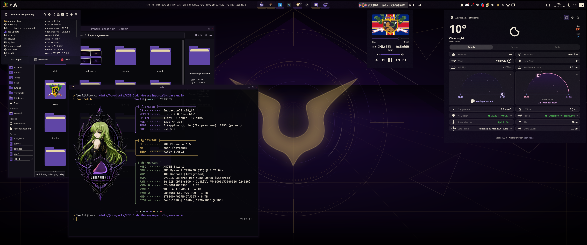
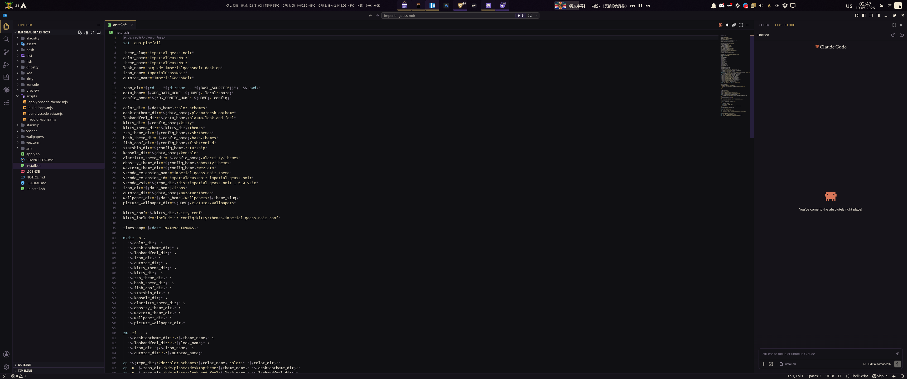

# Imperial Geass Noir

`Imperial Geass Noir` is a personal KDE Plasma 6 rice/theme package built around
a dark imperial rebellion mood: black lacquer, noir purple, muted crimson,
antique gold, thin HUD lines, glass-like surfaces, and a single top command bar.

This is not meant to be a neutral desktop preset. I made it for myself, for my
own workflow and visual philosophy: restrained, dark, premium, slightly
imperial, and more focused on a cohesive daily environment than on being
universally comfortable for every Plasma user. You can use it as-is, fork it, or
strip it for parts, but some defaults are intentionally opinionated.

Version: `1.0.1`

## Screenshots


*(Note: The fastfetch configuration shown in this screenshot is not included in the theme)*



## Design Notes

- Dark KDE Plasma 6 theme inspired by imperial anime aesthetics, but not a
  character-art theme.
- Top panel only.
- Wayland-first, with guarded X11-compatible commands where practical.
- Main colors:
  - Background: `#07070B`
  - Surface: `#111018`
  - Panel: `#0D0B12` / noir purple variants
  - Purple: `#6046A6`
  - Crimson: `#9E102B`
  - Gold: `#C4A45A`
  - Text: `#E8E1D2`
- Default wallpaper variant uses the gold sigil.
- System font target: `IBM Plex Sans`.
- Monospace target: `IBM Plex Mono`, with terminal profiles also supporting
  Nerd Font setups where useful.

## What Is Included

- KDE color scheme: `Imperial Geass Noir`
- Plasma desktop theme: `Imperial Geass Noir`
- Plasma look-and-feel package: `Imperial Geass Noir`
- Aurorae/KWin window decoration: `Imperial Geass Noir`
- Papirus-derived icon theme recolored for the Noir palette
- Top-panel Plasma layout script
- Wallpapers for standard and ultrawide monitors
- Kitty, Konsole, Alacritty, Ghostty, and WezTerm color profiles
- zsh, bash, fish, and Starship prompt profiles
- VS Code / Code OSS / VSCodium color theme extension

## Target Desktop

The rice is tuned around my current Plasma setup, not an abstract default
desktop. The scripts still try to degrade safely when optional widgets are not
installed.

Core target:

- KDE Plasma 6
- KWin / Wayland
- Aurorae window decoration support
- Top panel, height around `42 px`
- `kitty` as the primary terminal
- `IBM Plex Sans` as the system UI font
- `IBM Plex Mono` / Nerd Font capable monospace terminal setup

Panel widgets used by the bundled layout:

- `org.kde.plasma.kickoff`  
  Application Launcher
- `com.github.exequtic.apdatifier`  
  Arch/update widget, optional
- `org.kde.plasma.appmenu`  
  Global Menu
- `org.kde.plasma.kvitals`  
  System metrics, optional
- `org.kde.plasma.icontasks` or `org.kde.plasma.taskmanager`  
  Task manager
- `plasmusic-toolbar`  
  Media controls, optional
- `org.kde.plasma.systemtray`  
  Compact desktop-focused tray
- `org.kde.plasma.keyboardlayout`
- `org.kde.plasma.digitalclock`
- `org.kde.plasma.advanced-weather-widget`  
  Weather, optional
- `org.kde.plasma.showdesktop`

System tray defaults are deliberately not overloaded. The layout keeps useful
desktop items visible, such as Bluetooth, brightness, clipboard, device
notifier, network, notifications, and volume, while hiding duplicates or noisy
items such as battery, duplicate media controller, printers, camera indicator,
input method, and duplicate weather/tray entries.

## Requirements

Required:

- KDE Plasma 6
- Bash
- Node.js, for rebuilding the VS Code VSIX and icon/theme helper scripts
- `zip`, for VS Code VSIX packaging
- `qt6-svg`, for Plasma SVG assets
- `kpackage`, for KDE package installation helpers
- Aurorae/KWin decoration support
- IBM Plex fonts

Useful KDE commands when available:

- `plasma-apply-colorscheme`
- `plasma-apply-desktoptheme`
- `lookandfeeltool`
- `kpackagetool6`
- `kwriteconfig6`
- `qdbus6` or `qdbus`
- `kquitapp6`
- `kstart6`

Arch Linux package suggestions:

```sh
sudo pacman -S plasma-desktop plasma-workspace qt6-svg kpackage kitty ttf-ibm-plex nodejs zip
```

Optional:

```sh
sudo pacman -S kvantum
```

Kvantum and Klassy are not required. The package uses Breeze as the Qt widget
style unless you choose another Qt style manually.

## Install

From the repository root:

```sh
chmod +x install.sh apply.sh uninstall.sh kde/scripts/apply-plasma-layout.sh
./install.sh
```

The installer copies user-local files into:

- `~/.local/share/color-schemes`
- `~/.local/share/plasma/desktoptheme`
- `~/.local/share/plasma/look-and-feel`
- `~/.local/share/icons/ImperialGeassNoir`
- `~/.local/share/aurorae/themes/ImperialGeassNoir`
- `~/.local/share/wallpapers/imperial-geass-noir`
- `~/Pictures/Wallpapers`
- `~/.config/kitty/themes`
- `~/.config/zsh/themes`
- `~/.config/bash/themes`
- `~/.config/fish/conf.d`
- `~/.config/starship`
- `~/.local/share/konsole`
- `~/.config/alacritty/themes`
- `~/.config/ghostty/themes`
- `~/.config/wezterm`

For VS Code-like editors, the installer builds:

```text
dist/imperial-geass-noir-1.0.1.vsix
```

Then it installs the extension through any available CLI:

```sh
code --install-extension dist/imperial-geass-noir-1.0.1.vsix --force
code-oss --install-extension dist/imperial-geass-noir-1.0.1.vsix --force
codium --install-extension dist/imperial-geass-noir-1.0.1.vsix --force
vscodium --install-extension dist/imperial-geass-noir-1.0.1.vsix --force
```

If no compatible CLI exists, it falls back to copying extension files into the
common extension directories.

The installer does not overwrite `kitty.conf` silently. If
`~/.config/kitty/kitty.conf` exists, it creates a timestamped backup before
adding the Imperial Geass Noir include line.

## Apply

Run:

```sh
./apply.sh
```

The apply script detects commands before using them. It attempts to apply:

- KDE color scheme
- Plasma style
- Global Theme
- icon theme
- Aurorae window decoration
- top panel layout
- gold wallpaper with per-monitor aspect detection
- IBM Plex Sans / IBM Plex Mono system fonts
- Dolphin and Konsole defaults
- VS Code / Code OSS / VSCodium theme
- zsh, bash, fish, and Starship prompt profiles

It does not force a Plasma restart. Restart open KDE apps or log out and back in
if fonts, icons, panel SVGs, or theme assets do not refresh immediately.

## Manual KDE Setup

If automated apply is incomplete:

1. Open System Settings.
2. Select `Imperial Geass Noir` under Global Theme.
3. Select `Imperial Geass Noir` under Colors.
4. Select `Imperial Geass Noir` under Plasma Style.
5. Select `Imperial Geass Noir` under Icons.
6. Select `Imperial Geass Noir` under Window Decorations.
7. Set the system font to `IBM Plex Sans`.
8. Set the fixed-width font to `IBM Plex Mono`.

Panel layout:

1. Use one top panel.
2. Set panel height around `42 px`.
3. Add widgets in this order:
   Application Launcher, Apdatifier, Global Menu, spacers, KVitals,
   Icons-only Task Manager, Plasmusic Toolbar, System Tray, Keyboard Layout,
   Digital Clock, Advanced Weather Widget, Show Desktop.
4. Keep System Tray compact and avoid duplicating widgets already present on
   the panel.

Plasma scripting APIs for floating panels, adaptive opacity, and widget config
change across Plasma versions. The included layout scripts use guarded calls and
continue when a property is unavailable.

## Wallpapers

Installed variants:

- Gold Geass, default:
  - `imperial-geass-noir-gold.svg`
  - `imperial-geass-noir-gold-ultrawide.svg`
- Purple Geass:
  - `imperial-geass-noir.svg`
  - `imperial-geass-noir-ultrawide.svg`
- Dark-crimson Geass:
  - `imperial-geass-noir-crimson.svg`
  - `imperial-geass-noir-crimson-ultrawide.svg`

The apply script uses the gold variant by default. It applies the ultrawide
gold wallpaper to screens with aspect ratio `>= 2.0`, and the standard gold
wallpaper to narrower screens.

## Terminal Profiles

Kitty:

```text
~/.config/kitty/themes/imperial-geass-noir.conf
```

Konsole:

```text
~/.local/share/konsole/ImperialGeassNoir.colorscheme
~/.local/share/konsole/ImperialGeassNoir.profile
```

Additional terminal profiles:

- Alacritty: `~/.config/alacritty/themes/imperial-geass-noir.toml`
- Ghostty: `~/.config/ghostty/themes/imperial-geass-noir`
- WezTerm: `~/.config/wezterm/imperial-geass-noir.lua`

Alacritty, Ghostty, and WezTerm require a manual import/include in the user's
main terminal config.

## VS Code / Code OSS / VSCodium

Extension id:

```text
imperialgeassnoir.imperial-geass-noir
```

Manual build:

```sh
node scripts/build-vscode-vsix.mjs
```

Manual install:

```sh
code-oss --install-extension dist/imperial-geass-noir-1.0.1.vsix --force
```

The apply script sets this when a matching settings directory exists:

```json
"workbench.colorTheme": "Imperial Geass Noir"
```

Manual selection: open Command Palette, run `Preferences: Color Theme`, then
choose `Imperial Geass Noir`.

## Shell Profiles

`apply.sh` links zsh and bash through marked blocks:

```text
# >>> Imperial Geass Noir >>>
source "$HOME/.config/zsh/themes/imperial-geass-noir.zsh"
# <<< Imperial Geass Noir <<<
```

```text
# >>> Imperial Geass Noir Bash >>>
source "$HOME/.config/bash/themes/imperial-geass-noir.sh"
# <<< Imperial Geass Noir Bash <<<
```

Fish loads this file automatically:

```text
~/.config/fish/conf.d/imperial-geass-noir.fish
```

Starship users can opt into:

```sh
export STARSHIP_CONFIG="$HOME/.config/starship/imperial-geass-noir.toml"
```

The zsh profile removes common competing prompt hooks from Powerlevel,
Starship, Spaceship, and Pure-style prompts after it is sourced so the prompt
remains consistent.

## Uninstall

Run:

```sh
./uninstall.sh
```

The uninstall script removes only installed Imperial Geass Noir files from
user-local locations. It does not delete `kitty.conf`, `.zshrc`, or `.bashrc`;
it removes only exact Imperial Geass Noir marked/include lines where possible.

## Restore Backups

Installer backups are written next to edited files, for example:

```text
~/.config/kitty/kitty.conf.backup-20260517-153000
~/.zshrc.backup-20260517-153000
~/.bashrc.backup-20260517-153000
```

Restore by moving the backup over the edited file.

## Licensing And Attribution

Original Imperial Geass Noir project files are licensed as GPL-3.0-or-later.
See `LICENSE`.

Derived or third-party assets:

- Aurorae decoration: modified derivative of Daemon-2.0 by Mathis Paquet
  (`GPL_V3` metadata), recolored and adapted for Imperial Geass Noir.
- Icon theme: recolored derivative of the user-provided Papirus Vectorel icon
  pack. The untouched source is kept under
  `kde/icons/source/Papirus-Icon-Theme-Vectorel-Folders-master/`; the generated
  theme uses full `Papirus` as the base and overlays `Papirus-Adapta-Nokto`
  assets before recoloring. Its LGPL-3.0-or-later licensing and attribution
  context are retained in the icon directory.
- Application launcher crest: extracted unchanged from Wikimedia Commons
  `File:Holy Britannian Empire.svg` by Jud nereide, licensed as CC BY 4.0.
  Only the crest group is used; the flag background is not included. See
  `assets/holy-britannian-crest.svg` and `NOTICE.md`.
- Wallpaper sigil: derived from Wikimedia Commons `File:Geass.svg` by Koveras
  at English Wikipedia. Wikimedia lists GFDL-1.2-or-later and CC BY-SA
  1.0/2.0/2.5/3.0. This package selects CC BY-SA 3.0 for the wallpaper
  derivative. See `NOTICE.md`.

The package includes no anime screenshots or character art. It does include
separately attributed third-party franchise-derived symbols noted above; review
`NOTICE.md` before redistributing modified releases.

## Maintainer Notes

Rebuild the icon theme from the untouched bundled Papirus source:

```sh
node scripts/build-icons.mjs
```

`build-icons.mjs` recreates `kde/icons/ImperialGeassNoir` from the source
backup, overlays the Nokto/Vectorel variant, then runs `recolor-icons.mjs`.
Do not run recoloring repeatedly over an already generated theme; rebuild from
source instead.

Build the VS Code extension:

```sh
node scripts/build-vscode-vsix.mjs
```

## Troubleshooting

- If the theme does not appear in System Settings, run `./install.sh` again and
  log out and back in.
- If Dolphin or other KDE apps keep previous colors/icons, restart those apps.
- If Window Decorations does not list `Imperial Geass Noir`, verify that
  Aurorae/KWin decoration support is installed for your Plasma build.
- If the top panel script fails, create the panel manually using the widget
  order above.
- If VS Code does not list the theme, run
  `code-oss --list-extensions --show-versions | grep imperialgeassnoir` and
  reinstall the VSIX manually.
- If IBM Plex fonts are not applied, install `ttf-ibm-plex`, re-run
  `./apply.sh`, and restart open KDE apps.

## Key Files

- `kde/color-schemes/ImperialGeassNoir.colors`
- `kde/plasma/desktoptheme/ImperialGeassNoir/`
- `kde/plasma/look-and-feel/org.kde.imperialgeassnoir.desktop/`
- `kde/aurorae/themes/ImperialGeassNoir/`
- `kde/icons/ImperialGeassNoir/`
- `kde/scripts/top-panel-layout.js`
- `kitty/imperial-geass-noir.conf`
- `konsole/ImperialGeassNoir.colorscheme`
- `zsh/imperial-geass-noir.zsh`
- `bash/imperial-geass-noir.sh`
- `fish/conf.d/imperial-geass-noir.fish`
- `starship/imperial-geass-noir.toml`
- `vscode/imperial-geass-noir/`
- `scripts/recolor-icons.mjs`
- `scripts/build-vscode-vsix.mjs`
- `wallpapers/`
